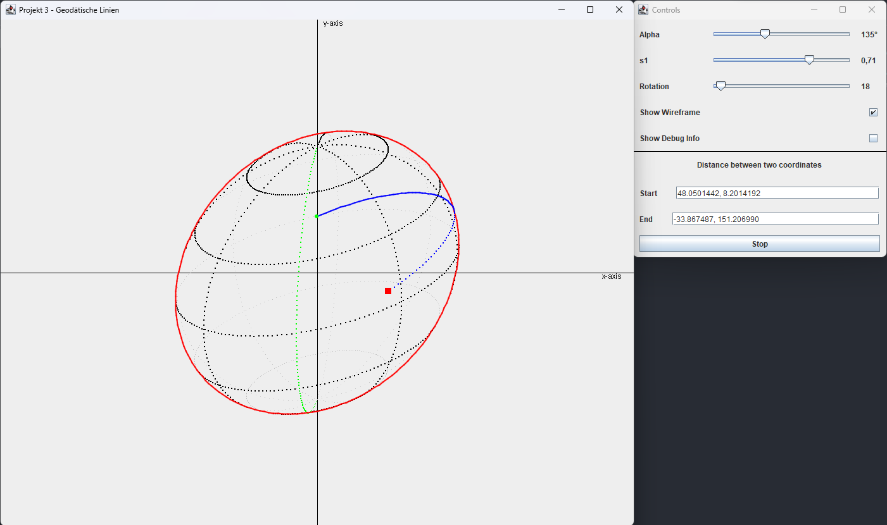

# 3D-Simulation von Bewegungen entlang geodätischer Linien auf der Erdkugel mit Java

## Gruppenprojekt an der HFU im Rahmen Seminars *Mathematik und Simulation*

#### Von Niklas Riedinger, Clara Gey

#### Dozent: Uwe Hahne
#### Sommersemester 23

### [Zu den Präsentationsfolien](https://github.com/HFU-DM-MuS/projekt-03-geodatische-linien-gruppe-3-2/blob/main/media/MuS_Thema_3_2_Praesentationsfolien.pdf)

## Aufgabenstellung

Ziel des Projektes war es, eine graphische Java-Anwendung zu programmieren, welche die kürzeste (Flug-)Strecke zweier
Punkte auf der Erde berechnet, diese graphisch anzeigt und animiert.

